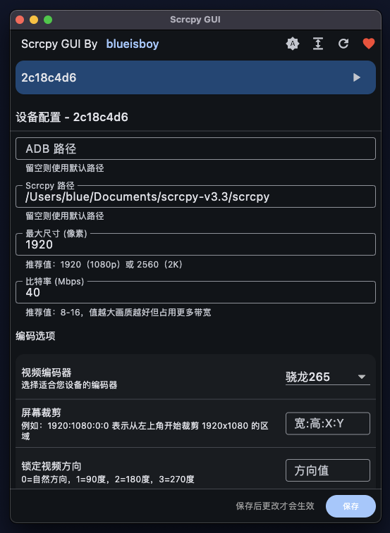

# Scrcpy GUI

[English](README_EN.md) | 简体中文

一个基于 Flutter 开发的 Scrcpy 图形界面工具，支持设备特定的配置管理。



## 功能特点

- 🖥️ 简洁美观的图形界面
- 📱 支持多设备管理
- ⚙️ 设备特定的配置保存
- 🌓 支持浅色/深色主题
- 📐 支持紧凑/舒适两种显示模式
- 🔄 实时设备状态监控
- 🎮 一键启动 Scrcpy

## 系统要求

- Flutter SDK >= 3.0.0
- Dart SDK >= 3.0.0
- 操作系统：Windows/macOS/Linux
- ADB 工具（通常随 Scrcpy 一起提供）

## 快速开始

1. 确保已安装 Flutter 开发环境
2. 克隆项目到本地
3. 运行以下命令：

```bash
# 获取依赖
flutter pub get

# 运行项目
flutter run
```

## 编译说明

### Windows

```bash
flutter build windows
```

### macOS

```bash
flutter build macos
```

### Linux

```bash
flutter build linux
```

## 使用说明

1. 首次运行时，需要配置 ADB 路径
   - 通常 ADB 会随 Scrcpy 一起提供
   - 也可以使用系统安装的 ADB

2. 连接设备
   - 通过 USB 连接 Android 设备
   - 确保设备已启用 USB 调试
   - 点击刷新按钮检测设备

3. 配置设备
   - 点击设备卡片进入配置界面
   - 可以设置 Scrcpy 的各项参数
   - 配置会自动保存

4. 启动 Scrcpy
   - 点击设备卡片上的播放按钮
   - 等待 Scrcpy 窗口打开

## 开发说明

项目使用以下主要依赖：

- flutter_riverpod: 状态管理
- window_manager: 窗口管理
- process_run: 进程管理
- shared_preferences: 配置存储

## 支持项目

如果您觉得这个工具对您有帮助，欢迎打赏支持作者继续开发！

### 微信支付


### 支付宝


您的每一份支持都是我继续前进的动力！

## 许可证

MIT License

## 作者

blueisboy
