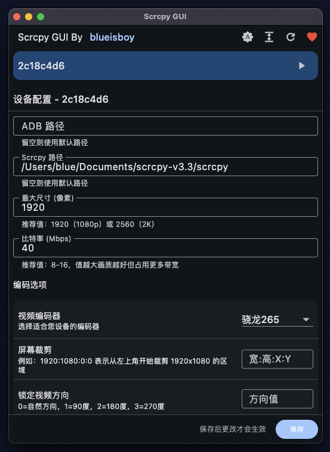

# Scrcpy GUI

English | [简体中文](README.md)

A Flutter-based graphical interface for Scrcpy with device-specific configuration management.



## Features

- 🖥️ Clean and beautiful graphical interface
- 📱 Multi-device management support
- ⚙️ Device-specific configuration saving
- 🌓 Light/Dark theme support
- 📐 Compact/Comfortable display modes
- 🔄 Real-time device status monitoring
- 🎮 One-click Scrcpy launch

## System Requirements

- Flutter SDK >= 3.0.0
- Dart SDK >= 3.0.0
- Operating System: Windows/macOS/Linux
- ADB tools (usually provided with Scrcpy)

## Quick Start

1. Ensure Flutter development environment is installed
2. Clone the project locally
3. Run the following commands:

```bash
# Get dependencies
flutter pub get

# Run the project
flutter run
```

## Build Instructions

### Windows

```bash
flutter build windows
```

### macOS

```bash
flutter build macos
```

### Linux

```bash
flutter build linux
```

## Usage Guide

1. First Run Configuration
   - Configure ADB path on first run
   - ADB is usually provided with Scrcpy
   - Can also use system-installed ADB

2. Connect Device
   - Connect Android device via USB
   - Ensure USB debugging is enabled
   - Click refresh button to detect devices

3. Configure Device
   - Click device card to enter configuration
   - Set various Scrcpy parameters
   - Configurations are automatically saved

4. Launch Scrcpy
   - Click play button on device card
   - Wait for Scrcpy window to open

## Development Notes

Project uses the following main dependencies:

- flutter_riverpod: State management
- window_manager: Window management
- process_run: Process management
- shared_preferences: Configuration storage

## Support the Project

If you find this tool helpful, please consider supporting the development!

### WeChat Pay


### Alipay


Your support is the driving force for continuous development!

## License

MIT License

## Author

blueisboy 